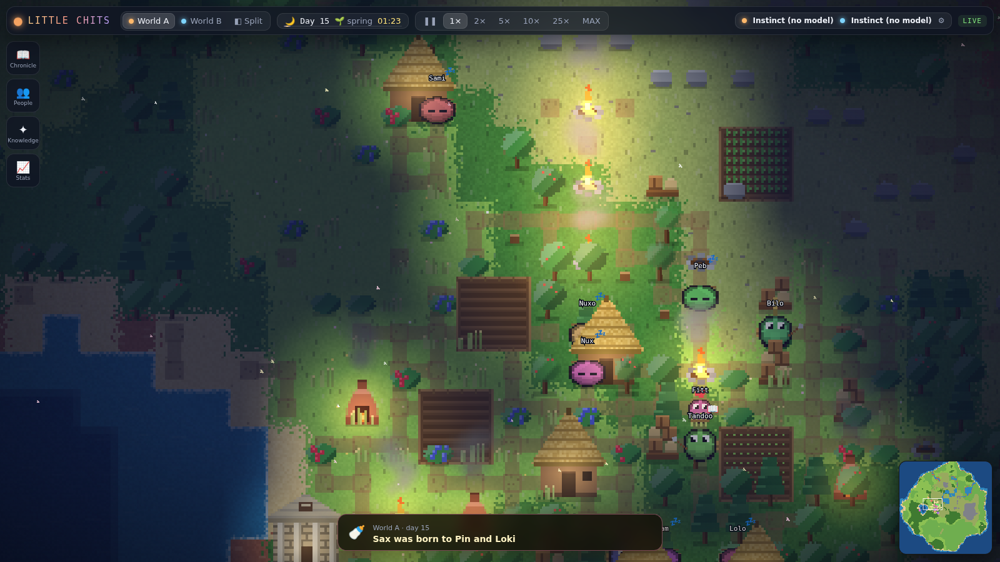
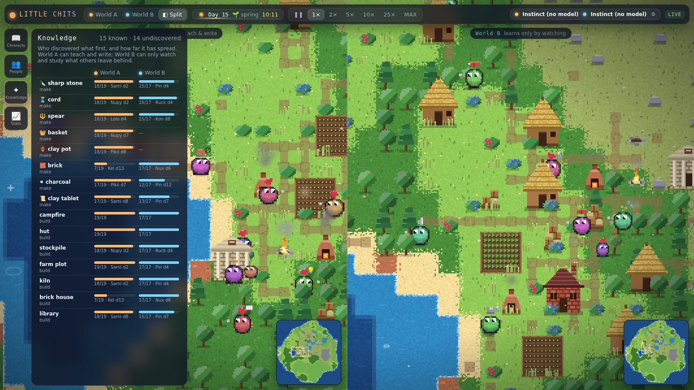
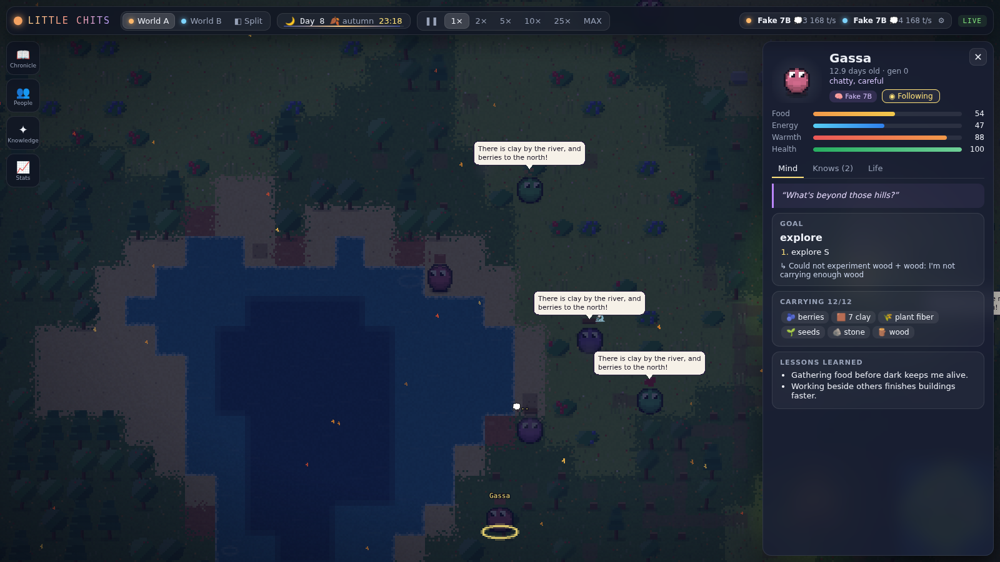
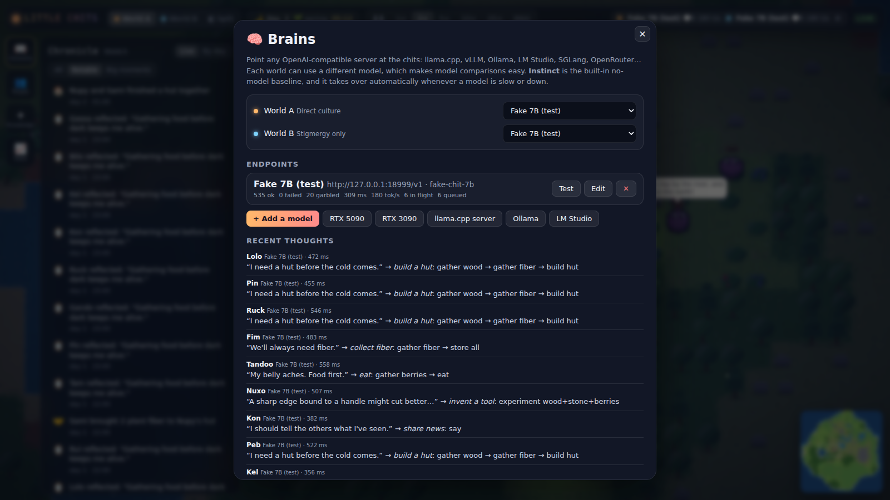

# LITTLE CHITS

A living artificial civilisation you can watch. Tiny AI creatures (**chits**) wake up on an island knowing
almost nothing. They get hungry, get cold and grow tired. They experiment with what they find, discover how
things combine, build homes and workshops together, teach each other (or can't), have children, grow old, and
leave behind a world that remembers them.

You can plug **any LLM** into their minds. A local GGUF on llama.cpp, vLLM on your GPUs, Ollama, LM Studio, or
a cloud API all work, and you can put a different model in each world to see which one builds the better
civilisation.



## Play in 2 minutes

```bash
git clone https://github.com/Blackwellboy/little-chits && cd little-chits
make play
# then open http://localhost:8000 (it opens by itself on most machines)
```

That's it. The first time it runs, it looks for model servers on this computer (llama-server, Ollama,
LM Studio, vLLM…). If it finds two, it starts **model vs model** on the same island; if it finds one, a
**single-model** world. With none, the chits run on instinct until you add a model in **⚙ Brains**.
Use `make play-single` to force one world, or `make play PORT=8010` for another port.

**Docker instead** (Linux; it uses host networking so it can see model servers on `localhost`):

```bash
CHITS_TOKEN=pick-a-secret docker compose up --build
# open http://localhost:8000/?token=pick-a-secret
```

**Docker Desktop on Windows or macOS** has no host networking, so it has its own file. Nothing to edit:

```bash
CHITS_TOKEN=pick-a-secret docker compose -f docker-compose.desktop.yml up --build
# open http://localhost:8000/?token=pick-a-secret
```

- In PowerShell, set the token first: `$env:CHITS_TOKEN = "pick-a-secret"`, then run the `docker compose` line.
  With `make`, it is `CHITS_TOKEN=pick-a-secret make docker-desktop`.
- It refuses to start without `CHITS_TOKEN`. The game is published on this computer only (`127.0.0.1:8000`).
- Model servers on your computer are found by themselves: the first-run scan and **⚙ Brains → 🔍 Scan** look at
  `host.docker.internal`. To add one by hand, use `http://host.docker.internal:PORT/v1` (not `localhost`: inside
  the container that is the container itself).
- Your model server must accept connections from Docker, not only from `127.0.0.1` (for example
  `llama-server --host 0.0.0.0`, or `OLLAMA_HOST=0.0.0.0`).
- Another port: `CHITS_PORT=8010`. One model in both worlds: `CHITS_MODEL_URL=http://host.docker.internal:8080/v1`.
- The same file works on Linux. Saves are kept in `./data`.
- Auto-record (🎞) is not available in the container: it has no browser or `ffmpeg`.

Pushing a version tag (`v*`) builds the image and publishes it to GHCR (`.github/workflows/image.yml`). Once a
release exists you can skip the build: set `CHITS_IMAGE=ghcr.io/<owner>/<repo>:latest` and leave out `--build`.

On Windows the native WSL launcher is still the easiest way to use your GPUs (`make play` inside WSL, or
`make shortcut` for a desktop icon).

**If something goes wrong**

- *Port already in use* → `make play PORT=8010` (or `little-chits --port 8010`).
- *My model isn't found* → open **⚙ Brains** and press **🔍 Scan**, or start with
  `make play ARGS="--model http://127.0.0.1:18090/v1"`.
- *It's slow* → fewer chits: `CHITS_PER_WORLD=10 make play`, and see [docs/GPU_SETUP.md](docs/GPU_SETUP.md).
- *Sharing on your network* → `little-chits --host 0.0.0.0 --token SECRET` (it refuses a public address without
  a token), then open `http://<this-machine>:8000/?token=SECRET`.

## One double-click on Windows (WSL)

Once, in your WSL terminal:

```bash
cd ~/projects/little-chits
make shortcut
```

That puts two icons on your Windows desktop (it finds the desktop even if OneDrive moved it):

- **Little Chits** starts your model servers if they aren't running (using `~/start-gpus.sh`), waits until
  each model has actually answered a test decision, starts the game on port 8010 and opens
  http://localhost:8010. A small window says what it's doing ("Starting the 3090 model… ready") and, if
  something fails, which log to look at. Clicking it again when everything is up just opens the browser.
- **Stop Little Chits** saves the world and stops the game. It asks whether to stop the model servers too.

The icons survive reboots, `git pull` and moving the folder: their files live in `%LOCALAPPDATA%\LittleChits` and
call `~/.local/share/little-chits/desktop.sh` inside WSL, which finds this folder. Run `make shortcut` again to
repair or update them. The first time, `make shortcut` also creates `~/start-gpus.sh` for you to fill in with your
model files (see [docs/GPU_SETUP.md](docs/GPU_SETUP.md), "Desktop shortcut").

## Quick start

```bash
make install          # python venv + web deps (Python 3.10+, Node 18+)
make run              # world + observer on http://localhost:8000
```

Or in the background with the browser opened for you: `make open PORT=8010` (stop it with `make stop
PORT=8010`). On a Linux desktop, `make shortcut` adds a **Little Chits** icon to the desktop and app menu that
does the same with one double-click (on Windows, see the section above).

On first start it **scans your machine for model servers** (llama.cpp, vLLM, Ollama, LM Studio…). If it finds
two, you get **model vs model**. If it finds one, you get a **single-model** world. With none, the chits run on
**instinct** (a built-in no-model planner) until you add one: open **⚙ Brains**, press **🔍 Scan for models**
(or paste any OpenAI-compatible URL), and pick it.

**Game modes** (⟲ New game):

| Mode | What it is |
|---|---|
| ⚔ **Model vs model** | Two copies of the exact same island: same seed, same chits, same rules. The only difference is the model. |
| 🧠 **Single model** | One world, one model. Just watch it grow. |
| 🗣 **Culture experiment** | The same island twice, but World B can't talk, teach or write. It can only watch and leave marks. |

You can also do it from the command line:

```bash
# your RTX 5090 / 3090 servers (or anything that speaks /v1/chat/completions)
CHITS_MODEL_URL=http://127.0.0.1:18090/v1 make run

# llama.cpp with any GGUF from your folder
llama-server -m ~/gguf/Qwen3-8B-Q6_K.gguf --port 8080 -c 16384 -np 8 &
CHITS_MODEL_URL=http://127.0.0.1:8080/v1 make run

# Ollama
CHITS_MODEL_URL=http://127.0.0.1:11434/v1 CHITS_MODEL_NAME=qwen3:14b make run
```

**Setting up your GPUs step by step** (parallel slots, which model fits which card, the `scripts/gpu-server.sh`
helper and `make gpus` checker): [docs/GPU_SETUP.md](docs/GPU_SETUP.md).

To race two models against each other, copy `brains.example.json` to `server/data/brains.json` (World A on the
5090, World B on the 3090), or just pick them per world in the Brains panel. That is the normal live config because
the server runs from `server/`; set `CHITS_BRAINS=/path/to/file.json` to use another file. A root
`brains.local.json` is legacy and is ignored unless you explicitly point `CHITS_BRAINS` at it.

No GPU at hand? `make fake-model` starts a stand-in model server that produces messy, realistic replies, so
you can exercise the full model path.

## Two GPUs, two minds

```bash
make dual-doctor          # both servers answer and parse?
scripts/start_dual.sh      # 5090 → World A, 3090 → World B (ports in configs/dual-gpu.json)
```

If one card is down, its world keeps running on instinct and the script says so.

## The build plan (for your local coding models)

The road from here to "two GPUs, rival civilisations, ready-made X threads and clips" is a queue of 41
verified tasks in [`plan/`](plan/README.md). Each task has a spec and acceptance tests written up front. A local
coding model implements them one by one, and `scripts/plan.py` only ticks a task off when every gate passes.
Progress: [plan/PROGRESS.md](plan/PROGRESS.md).

```bash
AGENT=aider MODEL=openai/<your-coder> API_BASE=http://127.0.0.1:8080/v1 make plan-loop
```

## What makes them learn and grow

**The world has laws, not a tech tree.** Items have visible properties: stone is *hard, can be chipped*;
fiber is *flexible, stringy*; clay *hardens in heat*. Recipes are physics the chits can't see. They discover
them by **experimenting**: combining carried items, sometimes at a fire, kiln, furnace or workshop. When an
experiment fails, the world gives honest physical feedback ("It felt like it needed heat", "The pieces seemed
to want something more"). A model that reasons well about properties and feedback invents faster. That's
where model quality becomes visible.

**Tools change what's possible.**
- An axe doubles wood.
- A pick is needed for ore.
- A spear lets you fish.
- A basket lets you carry more.
- Copper tools beat stone ones.

**The ladder runs only through discovery:** knapped stone → cord → tools → fire and cooking → farming →
kilns, pottery and bricks → charcoal → a furnace → copper → glass and lanterns → writing on clay tablets →
libraries → monuments.

**Buildings are imagined from knowledge.** A chit can conceive of a stockpile once it knows how to make cord,
and a furnace once it knows bricks and has handled ore. Each building has a real function:
- Huts and houses let chits sleep, stay warm and raise children.
- Stockpiles are shared storage.
- Farms turn seeds into grain.
- Workshops, kilns and furnaces are the stations for advanced crafting.
- Roads make travel fast.
- Libraries hold tablets so knowledge outlives its writers.
- Monuments lift everyone's mood.

Campfires burn out and buildings decay, so maintenance matters.

**Seasons create real pressure.** In winter nothing grows and nights are bitter, so storage, shelter, fire and
farming stop being optional.

**Four kinds of learning:**
1. **Knowledge**, with provenance: discovered, taught, watched, reverse-engineered, or read. You can see how
   every chit learned everything it knows.
2. **Memory**: importance-scored episodic memories, recalled by relevance and recency.
3. **Lessons**: once a week (each on its own day) every model-driven chit reflects on its memories and keeps a few lessons that steer
   future plans.
4. **Skills**: practice makes gathering, crafting, building and farming faster. Specialisation emerges; it's
   never assigned. Roles in the UI are *inferred* from what chits actually do.

**Cooperation is physical.** Starting a building creates a construction site. Anyone can bring materials or
labour, and working together builds affinity. Friends with a home have children, who inherit a blend of their
parents' temperament but none of their knowledge.

## The twin-world experiment

Two worlds start from the same seed, with the same island and the same chits. They differ in one recorded law:

| | World A: direct culture | World B: stigmergy only |
|---|---|---|
| Talk | `say` (speech bubbles, heard and remembered) | ✗ |
| Teach | `teach` a recipe or design to a neighbour | ✗ |
| Write | inscribe tablets for others to read | ✗ |
| Watch others craft | ✓ | ✓ |
| Reverse-engineer items and buildings | ✓ | ✓ |
| Share via stockpiles and gifts | ✓ | ✓ |

The **Knowledge** tab shows who discovered what first in each world and how far it has spread. That's the
experiment, live.

## Making clips for X

**Record mode** is the game with no buttons: just the world, a small watermark, a title card for each new
day and 🎬 director captions. Open it in a browser and screen-record it:

| URL | What you get |
|---|---|
| `http://localhost:8010/?record=1` | 16:9 widescreen, World A, director on |
| `http://localhost:8010/?record=1&aspect=9:16&speed=5` | a vertical phone clip at 5× speed |
| `http://localhost:8010/?record=1&aspect=1:1&world=split` | square, both worlds side by side |

Other options: `world=A|B|split`, `director=0` (camera stays put), `captions=0`, `speed=1|2|5|10|25|100`.

**Auto-record: every day filmed, with its story.** Press **🎞 record** in the top bar and switch on
**Auto-record**. From then on the game films itself: both worlds side by side (or the one world in a
single-model game), with the director camera cutting to whatever is happening. When each in-game day ends you
get:

- `day-NNN.mp4`, a few seconds of timelapse of that day
- `day-NNN.md`, the day's story. For each world, **How they did it** (who worked out what and how, how far
  it spread and who taught it, the first of each building and who built it, beliefs founded, elections,
  births and deaths) comes first, followed by that day's chronicle.

Every 7 days the day clips are joined into a `week-NN.mp4` reel next to the week's saga. Watch them in the
🎞 panel (each clip has a download link), or find them in `server/data/recordings/<game>/`. It keeps
recording after a restart until you switch it off, and it needs the same `ffmpeg` and Playwright as below.
Under WSL it films at 720p in software (no GPU), which uses under half a CPU core; the clips are scaled up
to 1080p.

**A finished MP4 in one command.** This timelapses the running game into a clip (it needs `ffmpeg`, which
you can install with `sudo apt install ffmpeg`, and Playwright, which you can install with
`cd web && npm i -D playwright && npx playwright install chromium`):

```bash
make clip PORT=8010 ARGS="--aspect 9:16 --seconds 30"
```

It prints where the MP4 was saved (`data/clips/…`). A 30-second clip takes about 4 minutes of real time to
record.

**A whole model-vs-model run, packaged for posting.** This runs both worlds without the browser, as fast as
the models answer. Both worlds can talk (`--mode versus`, the default), so the two models are the only
difference; `--mode culture` makes World B silent instead. Both models get the same explicit sampling (`--top-p`,
`--top-k`, `--min-p`), since vLLM and llama.cpp have different defaults. It writes a folder with `summary.md`
(scoreboard, top moments and a ready X thread),
`card.svg` (a 1200×675 image) and the full event logs:

```bash
make experiment ARGS="--a http://127.0.0.1:18191/v1 --b http://127.0.0.1:18192/v1 --days 3"
```

**From the running game:** the 𝕏 Thread button in the Chronicle builds a thread from what really happened.
The scoreboard card is at `/api/story/card.svg`, and the thread as JSON is at `/api/story/x`.

## The observer

| Both worlds + the knowledge race | A chit's mind (model-driven, at night) | Plug in any model |
|---|---|---|
|  |  |  |

- The world fills the screen. Procedural pixel art is generated at boot, so there are no downloads.
  - A day/night cycle with real light: fires, kilns and windows glow in the dark.
  - Snow in winter, falling leaves in autumn, fireflies on summer nights.
  - Chits blink, bob, carry what they hold, swing their tools, and show 💭 while their model is actually
    thinking.
- **Click a chit** to see what it's up to:
  - its needs, and its thought in its own words
  - its current plan with step progress
  - what it's carrying, everything it knows and how it learned it
  - its lessons, memories, relationships and skills
  - a **Follow** button
- **Chronicle**: every notable thing that happened, live or by day, grounded in real events. Click any entry
  to fly there.
- **People**, **Knowledge** (A vs B), **Stats** (population, discoveries and buildings over time).
- **Split view** shows both worlds side by side. The speed control goes from 1× to MAX. The world keeps
  running with the browser closed, and it saves every in-game day and resumes on restart.

## Norse theme

An optional look: **Fjordfolk**. Switch it on in the game with the **Look** button in the top bar (● classic, ᚠ norse),
or start the server with `CHITS_THEME=norse` (for example `CHITS_THEME=norse make play`). The button's choice is kept
beside the saves and wins over `CHITS_THEME`. New chits get Norse names ("Astrid of the Fjord"), new worlds are called Fjordhaven
and Pineholm, and the observer switches to cool fjord colours, wool-clad villagers and timber halls under turf roofs.

- It is presentation only: the simulation draws the same random numbers, so a seed plays out exactly as it does
  without the theme. Saved names are kept as they are, so turn it on before starting a new game.
- Without `CHITS_THEME`, everything looks and behaves as before.
- `?theme=norse` or `?theme=default` in the observer's URL overrides the server's choice, for screenshots.

The names and how they map are in [`docs/norse-theme.md`](docs/norse-theme.md). Norse theme contributed by
@poptartsmmmgood117-bit.

## Configuration

| Env var | Default | |
|---|---|---|
| `CHITS_MODEL_URL` | – | drop a model into both worlds |
| `CHITS_MODEL_NAME` | first model the server lists | |
| `CHITS_MODEL_KEY` | – | API key (for hosted APIs) |
| `CHITS_MODEL_CONCURRENCY` | 6 | parallel requests |
| `CHITS_PER_WORLD` | 18 | starting population |
| `CHITS_SEED` | 1234 | island and starting chits |
| `CHITS_WORLD_SIZE` | 192 | map size in tiles (64–256); also chosen in the ⟲ New world dialog |
| `CHITS_MODE` | `versus` | starting game mode for a fresh install: `versus`, `single` or `culture` (later chosen in ⟲ New game) |
| `CHITS_AUTODETECT` | on | `0` skips the first-run scan for local model servers |
| `CHITS_SPEED` | 1 | 0, 1, 2, 5, 10, 25 or 100 |
| `CHITS_PACE` | 0 | `1` slows the world when models fall behind instead of letting instinct cover (experiment games always do) |
| `CHITS_DATA_DIR` | `data` | SQLite snapshots, event log, `brains.json` |
| `CHITS_THEME` | – | `norse` for the Norse theme (Fjordfolk); see [Norse theme](#norse-theme) |

**Throughput tip:**
- Each chit asks its model for a new plan every in-game hour or two (about 1,100 prompt tokens and a
  150-token reply).
- A 27B model on one GPU comfortably drives about 10–20 chits at 1×.
- With more chits, or slower models, enable pacing (the default) so the world waits for them.
- Or use fewer chits: `CHITS_PER_WORLD=10`.

## Architecture

```
server/chits/
  sim/        the authoritative world: terrain, items & laws, agents, actions, world tick
  brain/      mind.py (scheduling, prefetch, fallback, reflection), llm.py (OpenAI-compatible client),
              prompt.py (the scene a chit sees), parse.py (tolerant reply parsing), instinct.py (no-model planner)
  runtime.py  runs worlds forever, paces to brains, persists, fans out frames
  app.py      FastAPI: REST + one WebSocket, serves the built observer
web/src/
  render/     PixiJS v8 renderer + procedural art (art.ts, buildings.ts, WorldView.ts)
  ui/         React panels: top bar, inspector, chronicle, people, knowledge, stats, brains
tests/        world laws, A/B gating, parser fuzz, model end-to-end (fake server), long civilisation run
```

Principles kept from the original design:
- Cognition proposes and the simulator decides.
- There are no assigned professions.
- Chits only observe locally.
- The environment is memory.
- The twin worlds differ only in recorded flags.
- The chronicle only tells what happened.
- The world runs without the browser.

The design history (phases A–R, the Foundry roadmap, Astra audits) lives on the older branches. See
[`docs/OVERHAUL_PLAN.md`](docs/OVERHAUL_PLAN.md) for what changed and why.

```bash
make test     # 30 tests, ~10 s
make dev      # API with reload on :8000 + Vite on :5173
```

## Licence

MIT. See [LICENSE](LICENSE). Model weights you plug in keep their own licences.
